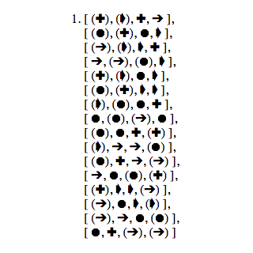

# The Ultimate Puzzle Solver

This repository has a solver written in JavaScript that prints out all 48 solutions (without reversing pieces) to [The Ultimate Puzzle](http://theultimatepuzzle.com/HomePage.html).

To run this project:
```
npm install
gulp serve
```

## Motivation

This program was written when another developer (and former math teacher) brought the puzzle into the office and offered to buy lunch for anyone who could solve it. Turns out I was the only one who tried writing a program to do it.

## The Puzzle

The puzzle contains 16 pieces. Each piece has a shape on each of its four sides. A shape can be one of four types or the inverse (blank) of that shape. If you allow some pieces to be flipped over, there are over 200 ways the shapes can be put together.


If you require all 16 pieces to have the same side facing up, there are only 48 distinct solutions. If solutions which differ only by a symmetrical rotation are counted as one, there are 12 fundamental solutions.

## Reading the Output

A printed solution looks like:



Each piece is listed on its own line and pieces are ordered top to bottom, left to right. Each piece has its four edges grouped between brackets, with the edges listed top, right, bottom, left. When a shape appears within parentheses, it indicates that that position has the blank (inverse) of that shape.

## Approach

The solver makes use of backtracking and some dynamic programming. While it does not use the most naive solution, I'm sure it could be significantly improved. I was able to improve the runtime by creating a pre-built "table" of which pieces will fit with which other pieces so that every piece doesn't need to be checked at each step to find a partial solution.